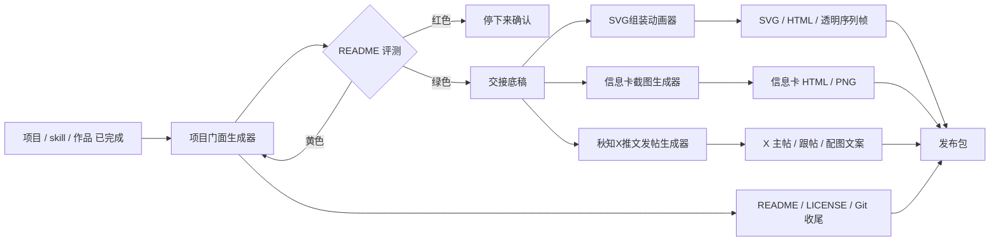

# 创作发布工作流总图

这份文档不是新的 skill，也不是某一个 skill 的内部备注。

它的作用是把当前创作库里已经成型的几条链路放到一张图里：

- `项目门面生成器`
- `SVG组装动画器`
- `信息卡截图生成器`
- `秋知X推文发帖生成器`

一句话理解：

`先整理门面，再形成底稿，再分发到视觉和平台。`

---

## 这份总图解决什么

它主要解决 4 个问题：

1. 哪个 skill 是上游，哪个 skill 是下游
2. 字段在什么时候生成，什么时候冻结
3. 哪些信息下游可以加工，哪些信息不能重新猜
4. 工作流到底停在哪一层，才算交付完成

---

## 当前默认链路



---

## 节点职责表

| 节点 | 它负责什么 | 它不该负责什么 | 交给下游的时机 | 主要交付 |
| --- | --- | --- | --- | --- |
| `项目门面生成器` | 调查仓库、判断层级、重构 README、评测 README、形成交接底稿、按策略处理 LICENSE / Git | 不应自己发明复杂 SVG 动画逻辑；不应自己重写平台发帖风格 | README 评测为绿色，且底稿已足够稳定 | README、交接底稿、结果单 |
| `SVG组装动画器` | 把静态 SVG 做成组装动画，输出 HTML 预览和透明序列帧 | 不应重新定义项目定位、动机、目标读者 | 已有 `视觉主标题 / 视觉副标题 / SVG` 或可复用视觉素材时 | HTML 动画页、透明 PNG 序列帧 |
| `信息卡截图生成器` | 把定位、亮点、截图整理成可传播的信息卡 | 不应重新猜项目价值主线 | 已有定位、亮点、推荐截图时 | HTML 信息卡、固定比例 PNG |
| `秋知X推文发帖生成器` | 消费交接底稿，产出主帖、跟帖、短版和配图文案 | 不应重新调查整个项目，不应推翻上游已确认的定位 | 已有交接底稿、主链接、推荐截图时 | 主帖、第一条带链接跟帖、备选版本 |

---

## 三层结构

这条链最好按三层理解：

### 1. 上游整理层

目标：

- 把项目先整理到“能见人、能介绍、能移交”的状态
- 把散乱信息收成稳定底稿

当前主节点：

- `项目门面生成器`

### 2. 中间交接层

目标：

- 不直接产出对外内容
- 负责把上游确认过的信息稳定传递给下游

当前核心载体：

- `交接底稿`
- `交接字段协议`
- `结果单`

### 3. 下游分发层

目标：

- 把已经确认过的项目信息变成不同平台或视觉形式的发布材料

当前主节点：

- `SVG组装动画器`
- `信息卡截图生成器`
- `秋知X推文发帖生成器`

---

## 字段协议表

下面这张表不是在重复 `交接字段协议.md`，而是把当前几条链最关键的字段压缩到一张执行表里。

| 字段组 | 字段 | 首次确认节点 | 下游能否重猜 | 主要消费方 |
| --- | --- | --- | --- | --- |
| 基础定位 | `项目名` | 项目门面生成器 | 否 | 全部 |
| 基础定位 | `一句话定位` | 项目门面生成器 | 否 | README / X / 信息卡 / SVG |
| 基础定位 | `为什么做` | 项目门面生成器 | 否 | X / 长文 / 平台适配 |
| 基础定位 | `解决什么问题` | 项目门面生成器 | 否 | README / 信息卡 / 发帖 |
| 基础定位 | `对谁有用` | 项目门面生成器 | 否 | README / 发帖 / 信息卡 |
| 价值表达 | `核心亮点` | 项目门面生成器 | 可重排，不可推翻 | README / 发帖 / 信息卡 |
| 分发入口 | `使用方式` | 项目门面生成器 | 可压缩，不可重定义 | README / 发帖 |
| 分发入口 | `主链接` | 项目门面生成器 | 否 | 发帖 / 信息卡 |
| 分发入口 | `推荐截图` | 项目门面生成器 | 可换顺序，不可无故换图 | X / 信息卡 |
| 分发入口 | `最想强调的一句话` | 项目门面生成器或人工 | 可改语气，不可换核心意思 | X / 信息卡 |
| 发布判断 | `当前状态` | 项目门面生成器 | 可补充，不可反向编造 | 发帖 |
| 发布判断 | `当前发布目标` | 项目门面生成器或人工 | 否 | 发帖 / 平台适配 |
| 视觉层 | `视觉意图` | 人工或项目门面生成器记录 | 否 | SVG / 信息卡 |
| 视觉层 | `可复用视觉素材` | 项目门面生成器调查 | 否 | SVG / 信息卡 |
| 视觉层 | `视觉主标题` | 项目门面生成器或人工 | 否 | SVG / 信息卡 |
| 视觉层 | `视觉副标题` | 项目门面生成器或人工 | 可微调，不可改方向 | SVG / 信息卡 |

---

## 不可重猜字段

这些字段一旦在上游确认，下游默认直接消费，不重新猜：

- `项目名`
- `一句话定位`
- `为什么做`
- `对谁有用`
- `主链接`
- `当前发布目标`
- `视觉主标题`（若已确认）

一句话理解：

**下游可以重写表达，但不能重写项目定义。**

---

## 可加工但不能推翻的字段

这些字段允许下游做二次组织，但不应推翻原意：

- `核心亮点`
- `最想强调的一句话`
- `推荐截图`
- `视觉副标题`
- `推荐传播角度`

例如：

- `秋知X推文发帖生成器` 可以决定先讲结果还是先讲动机
- `信息卡截图生成器` 可以重排模块顺序
- `SVG组装动画器` 可以决定零件飞入方式和节奏

但它们都不应该把“这是什么项目”重新写成另一件事。

---

## 缺字段时谁来补

默认顺序：

1. 先由 `项目门面生成器` 从 README、代码、截图、文档补
2. 若仍不足，再由下游 skill 从交接底稿和现有素材补小缺口
3. 只有会直接影响产物方向时，才最小化向用户确认

默认规则：

- 上游负责补结构性缺口
- 下游只补执行性缺口

例子：

- 缺 `一句话定位`：应该回到上游补
- 缺 `推荐配图顺序`：可以由 `秋知X推文发帖生成器` 现场给
- 缺 `视觉主标题`：若要做 SVG 动画，通常需要先回上游或人工确认

---

## 停机条件表

| 节点 | 默认停机条件 |
| --- | --- |
| `项目门面生成器` | README 评测为红色；授权策略不明且影响结果；Git 边界不清 |
| `SVG组装动画器` | 没有可拆件 SVG；没有视觉主标题或可复用视觉素材；任务本质不是 SVG 动画 |
| `信息卡截图生成器` | 没有定位、亮点或推荐截图；信息不足以组织卡面层级 |
| `秋知X推文发帖生成器` | 没有交接底稿、主链接或足够素材；不足以稳定判断发帖重心 |

---

## 默认调用句式

### 1. 先做上游门面整理

```text
用 $project-front-generator 按正式发布整理这个项目。
先把 README、交接底稿和结果单整理出来。
```

### 2. 若要接 SVG 动画

```text
用 $svg-assembly-animator 把这份 SVG 标题或横幅做成组装动画。
需要主体先出现，零件后飞入，
最后给我一个可预览的 HTML 和透明序列帧导出。
```

### 3. 若要接 X 发帖

```text
我已经有项目门面整理后的交接底稿了。
用 $qiuzhi-x-post-generator 帮我写一条 X 主帖，
再补第一条带链接跟帖。
```

---

## 当前最值得继续深化的点

这条链现在已经能跑，但还没完全“协议化”。

最值得继续补的 4 个点：

1. 把 `交接底稿` 固定成一个更硬的模板块，而不是散文段落
2. 给 `项目门面生成器` 增加“交接底稿已就绪 / 不足”的显式状态
3. 给视觉类和发帖类 skill 增加“已消费上游底稿”的确认句式
4. 给整条链加一份统一的发布包结果单，让发布是否完成更容易判断

---

## 关联文档

- [项目门面生成器 / 交接字段协议](./项目门面生成器/交接字段协议.md)
- [项目门面生成器 / 发布包定义](./项目门面生成器/发布包定义.md)
- [项目门面生成器 / 各产物评测标准](./项目门面生成器/各产物评测标准.md)
- [项目门面生成器 README](./项目门面生成器/README.md)
- [SVG组装动画器 README](./SVG组装动画器/README.md)
- [秋知X推文发帖生成器 README](./秋知X推文发帖生成器/README.md)

---

## 一句话结论

你现在真正搭起来的，不是三个孤立 skill，而是一条：

**上游整理 -> 协议交接 -> 下游分发 -> 发布包收口**

的创作发布链。
